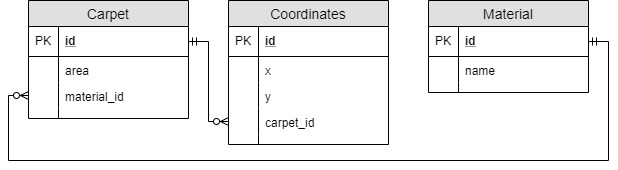
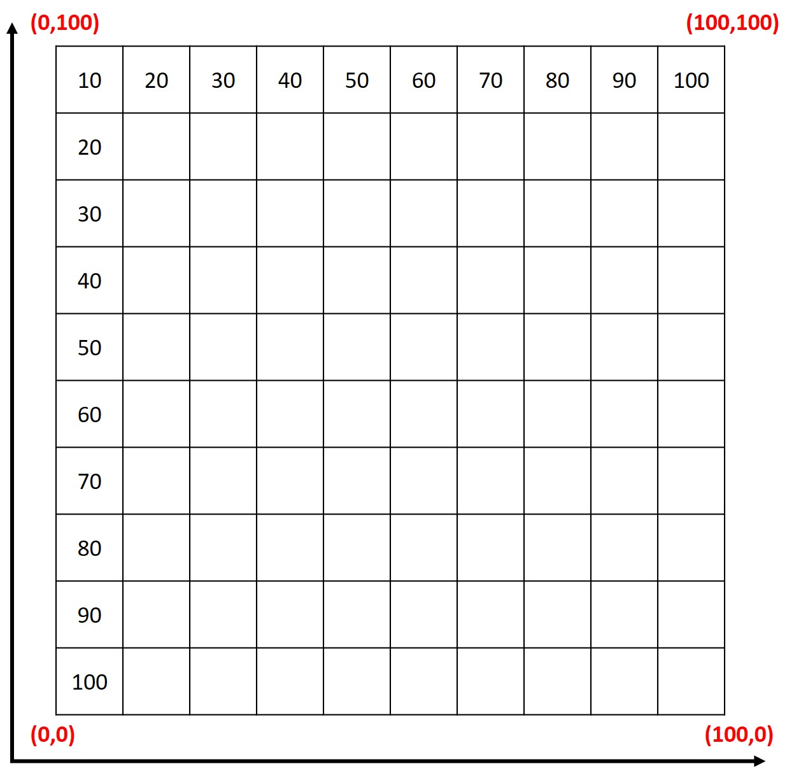
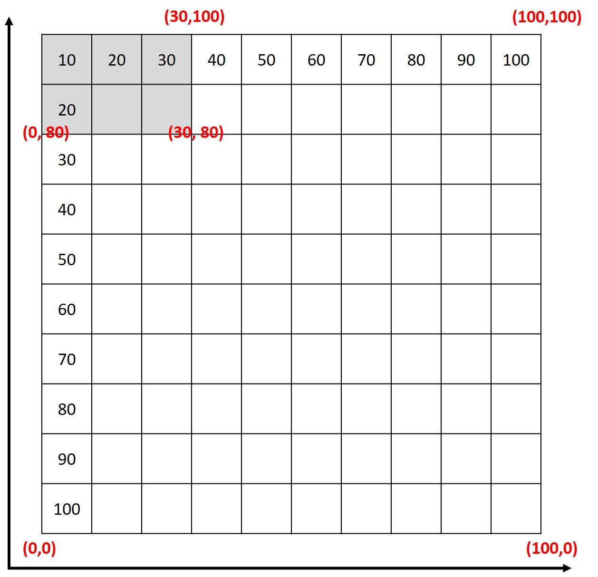

# carpetero

**CARPETERO** is a carpet distributor company.

Upon initial business analysis, here’s what we know about their process:
* They always restock by batches of 100x100m (i.e. 100 sqm) rolls of carpet.
* They deliver by cutting a rectangular area (e.g. 30x20m) of carpet from one of their inventory carpet rolls, and store the remaining carpet area for future cuts. The company prefers cutting from an already cut carpet roll.
* They have 4 carpet types: Wool, Nylon, Fiber and Acrylic.
* Width and Length are always specified in meters.
* Carpet orders from customers are always rectangular meters.

**TASK: Design a database schema that can track CARPETERO’s inventory.**



The minimum requirement of the database is to have the tables **Carpet**, **Coordinates**, and **Material**.

### Use cases

##### 1. Restock carpet rolls (i.e. Add a stock of 100x100m roll of carpet to inventory)

Whenever a stock of 100x100m roll of carpet is added to the inventory:
* A new record will be added to the Carpet table with a specified material (wool, nylon, fiber, or acrylic) and area (default value is 10000).
* 4 new records will be added to the Coordinates table referencing the newly added Carpet record. The default values are (0, 0), (100, 0), (100, 100), and (0, 100). These refer to the mapped coordinates of the 100x100m roll of carpet.



##### 2. Cut from a roll of carpet (i.e. Remove an area of size MxN meters from a roll of carpet in the inventory)

Whenever a roll of carpet with a specified measurement of MxN meters needs to be cut:
* Its coordinates will be updated based on the deducted values (MxN) and the area will be updated and recomputed using the shoelace algorithm (which is used to compute the area of a polygon).



For example, 30x20 was cut from location indicated in the image above. Its coordinates will now be (0, 0), (100, 0), (100, 100), (30, 100), (30, 80), and (0, 80) and its area will be 9400 sqm.

Computation:

```
a = ((x1 * y2) + (x2 * y3) + (x3 * y4) + (x4  * y5) + (x5  * y6) + (x6  * y1))
b = ((y1 * x2) + (y2 * x3) + (y3 * x4) + (y4  * x5) + (y5  * x6) + (y6  * x1))
```

```
a = 24800
b = 6000
a - b = 18800
1880 / 2 = 9400
```

Updated area: 9400 sqm. [Link to polygon area calculator.](https://www.mathopenref.com/coordpolygonareacalc.html)

##### 3. Select which roll of carpet to cut from.

In order to select which roll of carpet to cut from:
* The measurements of the needed carpet (MxN) will be measured against the maximum lengths and widths of the recently used carpets made with the correct material. If it's smaller than the required size, a new carpet will be used.